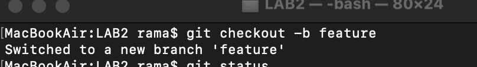
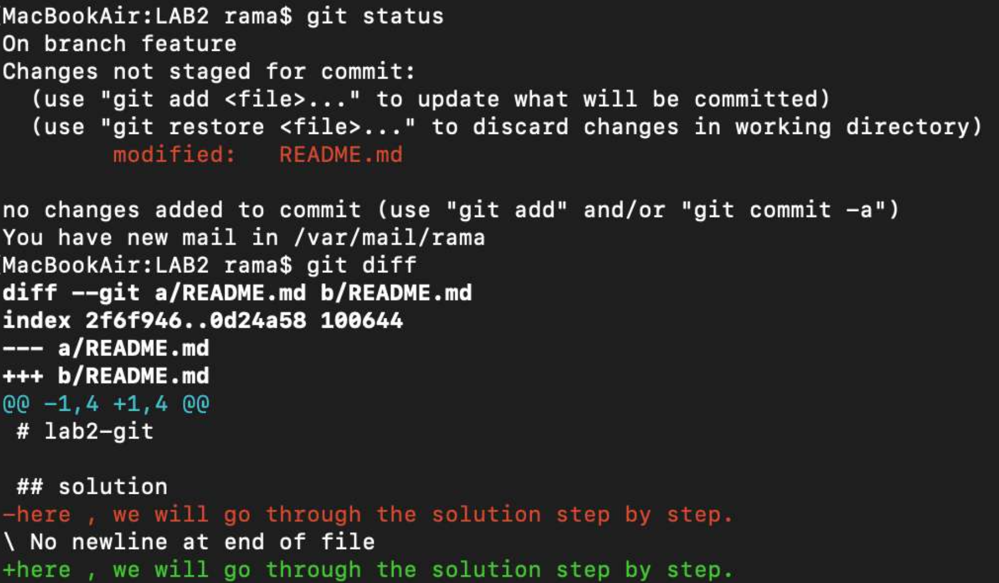
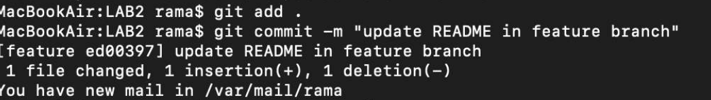
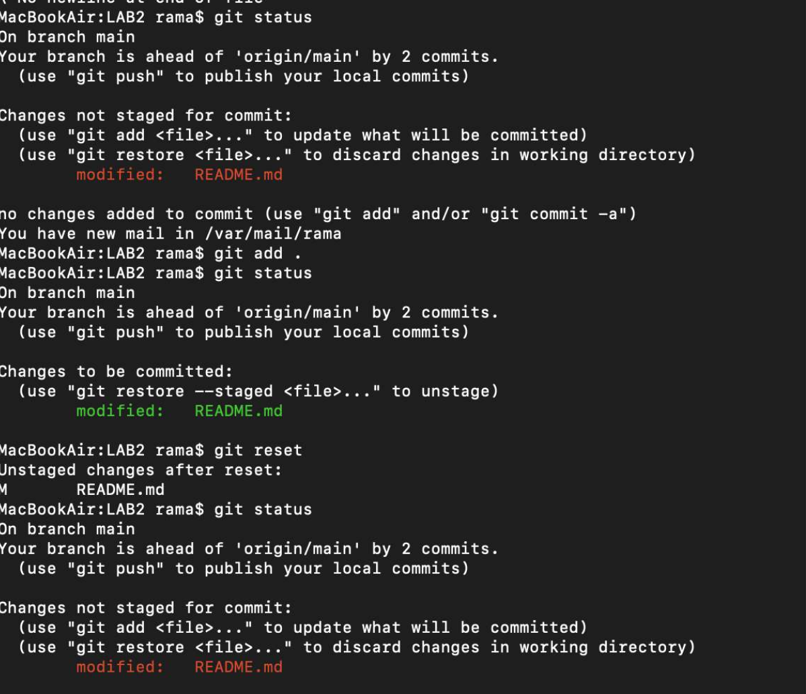
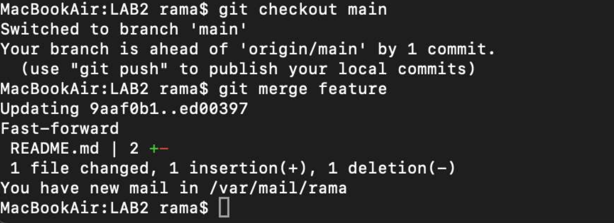

# lab2-git

## solution
here , we will go through the solution step by step.

------------------------------------------------------------

## step 1 - create a feature branch
i created a new branch called 'feature' and switched to it 

## step 2 - modify README.md
after creating the feature branch , i modified the README.md and added the solution desciption 

## step 3 - add and commit the changes 
after checking the changes i added them to the staging area 

## step 4 -practice git reset 
i practiced using git reset to remove changes from the staging area

## step 5 -merge the feature branch 
after completing the changes in the feature branch i switched back to the main branch then i merged feature branch intro main 

